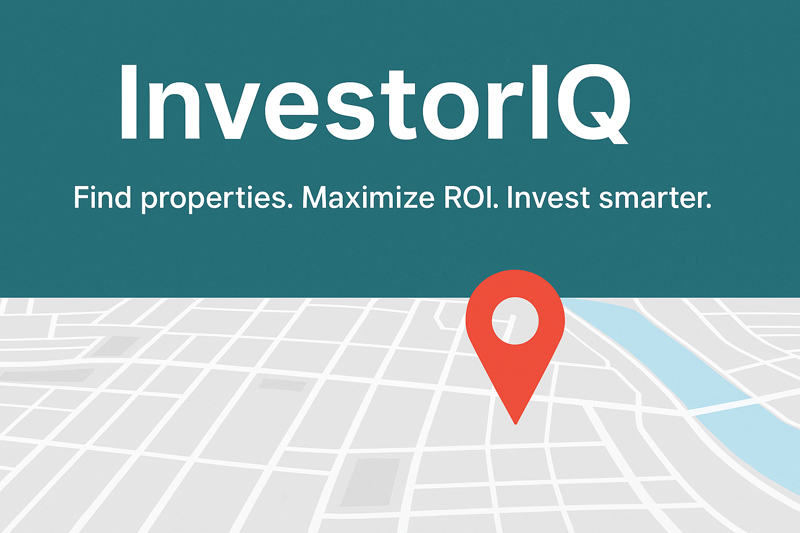

# InvestorIQ - Capstone-Group-01

## Tech Stack

 

 

 
 

InvestorIQ is a full-stack real estate investment analysis platform designed to help users discover profitable rental properties in any area. By combining data from the RentCast API and Google Maps, the platform delivers ROI-focused insights to support investment decisions.

## Features

- **Property Search & Visualization**  
  Explore potential investment properties with integrated Google Maps API.

- **Real-Time Rent Data**  
  Access rental comparable properties, vacancy rates, and more using RentCast's API.

- **ROI & Cash Flow Calculations**  
  Estimate return on investment, cash flow, and cap rates at listed purchase price.

- **Investor-Focused Insights**  
  Interface designed for all types of real-estate investors.

- **Deployed on locally hosted Ubuntu VMs**  
  Architecture running on Ubuntu 24.04 servers.

## Architecture

The project includes 4 key components:

1. **Frontend** – User interface with property input & data visualization. Includes a custom load distribution system that evenly routes incoming traffic across multiple frontend nodes, enhancing fault tolerance.
2. **Backend** – API endpoints, data validation, business logic. Incoming traffic is automatically balanced across multiple nodes, ensuring scalability and high availability.
3. **Database** – Stores user inputs, search history, and property metrics. Operates in a synchronized, multi-node replication system that supports read/write from any node, ensuring consistency.
4. **RabbitMQ** – Handles asynchronous communication between services. Built to resist network partitions, the cluster automatically resolves failures, maintaining service uptime.

