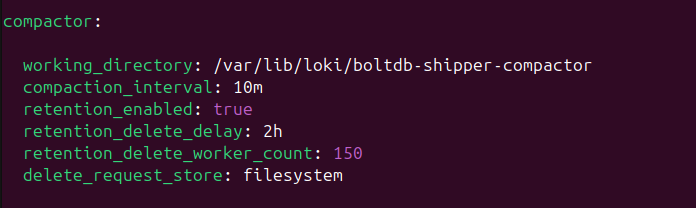

# Install required package
sudo apt-get install software-properties-common

# Add Suricata stable repository
sudo add-apt-repository ppa:oisf/suricata-stable

# Update package lists
sudo apt update

# Install Suricata and jq (for JSON processing)
sudo apt install suricata jq

sudo nano /etc/suricata/suricata.yaml

Part 2: Configure Suricata on Each VM
1. Basic Configuration
On each VM with Suricata, edit the main configuration file:
bashsudo nano /etc/suricata/suricata.yaml
Make these key changes:

Find the HOME_NET variable (near the beginning of the file) and set it to your network:
yamlHOME_NET: "[100.70.0.0/16, 100.71.0.0/16, 100.79.0.0/16, 100.82.0.0/16, 100.107.0.0/16]"

Enable the community ID (useful for cross-referencing events):
yaml# Find this line and set it to yes
community-id: yes

Configure the appropriate network interface by finding the af-packet section:
yaml# Find and modify this section
af-packet:
  af-packet:
  - interface: ens33
    cluster-id: 98
    cluster-type: cluster_flow
    defrag: yes
    use-mmap: yes


Ensure logs are in JSON format by checking the EVE output section (usually enabled by default):
yaml# Make sure this is enabled (usually already is)
- eve-log:
    enabled: yes
    filetype: regular
    filename: eve.json
    types:
      - alert
      - http
      - dns
      - tls
rule-files:
  - suricata.rules
  - local.rules  # Add this line if it's not there


# Update Suricata rules
sudo suricata-update

# Verify rules were installed correctly
sudo ls -la /var/lib/suricata/rules/

sudo suricata -T -c /etc/suricata/suricata.yaml

# Enable service to start on boot
sudo systemctl enable suricata

# Start the service
sudo systemctl start suricata

# Check status
sudo systemctl status suricata

### Promtail ###
# Download Promtail binary
wget https://github.com/grafana/loki/releases/download/v2.9.2/promtail-linux-amd64.zip
unzip promtail-linux-amd64.zip

# Move to a proper location
sudo mv promtail-linux-amd64 /usr/local/bin/promtail

# Create configuration directory
sudo mkdir -p /etc/promtail

Create Promtail configuration for each VM at /etc/promtail/config.yml (customize the host label for each VM):

nano /etc/promtail/config.yml

For frontend VM (100.70.91.110):
```bash
touch /etc/promtail/config.yml
nano /etc/promtail/config.yml
```
```bash
server:
  http_listen_port: 9080
  grpc_listen_port: 0

positions:
  filename: /tmp/positions.yaml

clients:
  - url: http://100.70.141.95:3100/loki/api/v1/push

scrape_configs:
  - job_name: suricata
    pipeline_stages:
      - json:
          expressions:
            event_type: event_type
            src_ip: src_ip
            proto: proto
            dest_port: dest_port
            alert: 
      - json:
          expressions:
            action: action
            signature_id: signature_id
            signature: signature
            category: category
            severity: severity
          source: alert
      - labels:
          event_type:
          src_ip:
          proto:
          dest_port: 
          signature_id:
          signature:
          category:
          severity:
    relabel_configs:
      - source_labels: [dest_port]
        regex: "7012"
        target_label: component
        replacement: "react_frontend"
      - source_labels: [dest_port]
        regex: "8000"
        target_label: component
        replacement: "php_api"
      - source_labels: [dest_port]
        regex: "8078"
        target_label: component
        replacement: "frontend_8078"
      - source_labels: [dest_port]
        regex: "8069"
        target_label: component
        replacement: "frontend_8069"
      - source_labels: [dest_port]
        regex: "8081"
        target_label: component
        replacement: "nodejs_backend"
      - source_labels: [dest_port]
        regex: "3306"
        target_label: component
        replacement: "mysql_database"
      - source_labels: [dest_port]
        regex: "5673"
        target_label: component
        replacement: "rabbitmq_messaging"
    static_configs:
      - targets:
          - localhost
        labels:
          job: suricata_logs
          host: "frontend"
          __path__: /var/log/suricata/eve.json
```
### Repeat for Frontend VM (change the host label to "frontend"), Database VM (change to "database"), and Messaging VM (change to "messaging").

### Create a systemd service for Promtail at /etc/systemd/system/promtail.service on each VM:
touch /etc/systemd/system/promtail.service
nano /etc/systemd/system/promtail.service

```bash
[Unit]
Description=Promtail service
After=network.target

[Service]
Type=simple
ExecStart=/usr/local/bin/promtail -config.file=/etc/promtail/config.yml
Restart=always

[Install]
WantedBy=multi-user.target
```

```bash
sudo systemctl daemon-reload
sudo systemctl start promtail
sudo systemctl enable promtail
```


sudo mkdir -p /var/lib/suricata/rules/

sudo touch /var/lib/suricata/rules/local.rules
sudo nano /var/lib/suricata/rules/local.rules
```bash
# Frontend monitoring (existing ports)
alert tcp any any -> $HOME_NET 7012 (msg:"React Frontend Traffic"; sid:1000001; rev:1;)
alert tcp any any -> $HOME_NET 8000 (msg:"PHP API Traffic"; sid:1000002; rev:1;)

# Additional frontend ports
alert tcp any any -> $HOME_NET 8078 (msg:"Frontend Port 8078 Traffic"; sid:1000010; rev:1;)
alert tcp any any -> $HOME_NET 8069 (msg:"Frontend Port 8069 Traffic"; sid:1000011; rev:1;)

# High volume detection for additional frontend ports
alert tcp any any -> $HOME_NET 8078 (msg:"High volume to Frontend Port 8078"; flow:to_server; threshold: type threshold, track by_src, count 100, seconds 10; sid:1000012; rev:1;)
alert tcp any any -> $HOME_NET 8069 (msg:"High volume to Frontend Port 8069"; flow:to_server; threshold: type threshold, track by_src, count 100, seconds 10; sid:1000013; rev:1;)

# Suspicious patterns for frontend ports
alert http $EXTERNAL_NET any -> $HOME_NET 8078 (msg:"Potential SQL Injection on Frontend Port 8078"; content:"union"; nocase; content:"select"; nocase; distance:0; sid:1000014; rev:1;)
alert http $EXTERNAL_NET any -> $HOME_NET 8069 (msg:"Potential SQL Injection on Frontend Port 8069"; content:"union"; nocase; content:"select"; nocase; distance:0; sid:1000015; rev:1;)

# Backend monitoring (existing)
alert tcp any any -> $HOME_NET 8081 (msg:"Node.js Backend Traffic"; sid:1000003; rev:1;)

# Database monitoring (existing)
alert tcp any any -> $HOME_NET 3306 (msg:"MySQL Database Traffic"; sid:1000004; rev:1;)

# Messaging monitoring (existing)
alert tcp any any -> $HOME_NET 5673 (msg:"RabbitMQ Messaging Traffic"; sid:1000005; rev:1;)

```

### Time for log rotation
```bash

cd /etc/logrotate.d/

sudo nano /etc/logrotate.d/suricata

```
```bash
/var/log/suricata/*.log {
    daily
    rotate 7
    create 640 root adm
    missingok
    notifempty
    compress
    delaycompress
    sharedscripts
    postrotate
        systemctl is-active --quiet suricata && systemctl kill -s HUP suricata
    endscript
}
```
### Log Compactor for Loki/Grafana
```bash
sudo nano /etc/loki/loki.yaml
```

```bash
sudo chown -R grafana:grafana /var/lib/loki/boltdb-shipper-compactor
```
#####
Add panels for monitoring your application ports:

Panel 1: Overall Port Activity

Query: sum by (dest_port, component) (count_over_time({job="suricata_logs"}[5m]))
Visualization: Bar gauge or Time series
Panel 2: Frontend Traffic (Ports 7012, 8000, 8078, 8069)

Query: sum by (dest_port) (count_over_time({job="suricata_logs", dest_port=~"7012|8000|8078|8069"}[5m]))
Visualization: Time series
Panel 3: React Frontend Traffic (Port 7012)

Query: {job="suricata_logs", dest_port="7012"} | json | line_format "{{.timestamp}} - {{.src_ip}}:{{.src_port}} → {{.dest_ip}}:{{.dest_port}}"
Visualization: Logs
Panel 4: Frontend Port 8078 Traffic

Query: {job="suricata_logs", dest_port="8078"} | json | line_format "{{.timestamp}} - {{.src_ip}}:{{.src_port}} → {{.dest_ip}}:{{.dest_port}}"
Visualization: Logs
Panel 5: Frontend Port 8069 Traffic

Query: {job="suricata_logs", dest_port="8069"} | json | line_format "{{.timestamp}} - {{.src_ip}}:{{.src_port}} → {{.dest_ip}}:{{.dest_port}}"
Visualization: Logs
Panel 6: Backend Traffic (Port 8081)

Query: {job="suricata_logs", dest_port="8081"} | json | line_format "{{.timestamp}} - {{.src_ip}}:{{.src_port}} → {{.dest_ip}}:{{.dest_port}}"
Visualization: Logs
Panel 7: Database Traffic (Port 3306)

Query: {job="suricata_logs", dest_port="3306"} | json | line_format "{{.timestamp}} - {{.src_ip}}:{{.src_port}} → {{.dest_ip}}:{{.dest_port}}"
Visualization: Logs
Panel 8: Messaging Traffic (Port 5673)

Query: {job="suricata_logs", dest_port="5673"} | json | line_format "{{.timestamp}} - {{.src_ip}}:{{.src_port}} → {{.dest_ip}}:{{.dest_port}}"
Visualization: Logs
Panel 9: Alerts Dashboard

Query: {job="suricata_logs", event_type="alert"} | json | line_format "{{.timestamp}} - {{.alert.signature}} ({{.src_ip}} → {{.dest_ip}}:{{.dest_port}})"
Visualization: Logs
Save your dashboard with a meaningful name like "Application Port Monitoring"